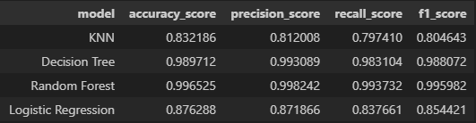
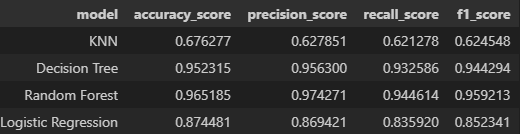
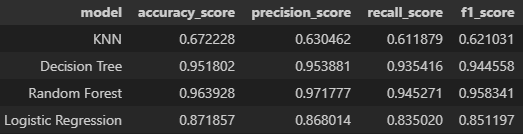
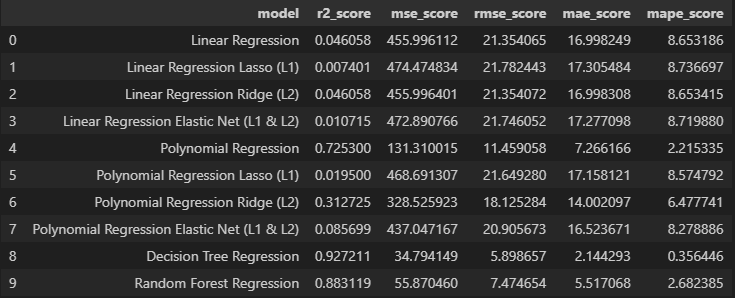
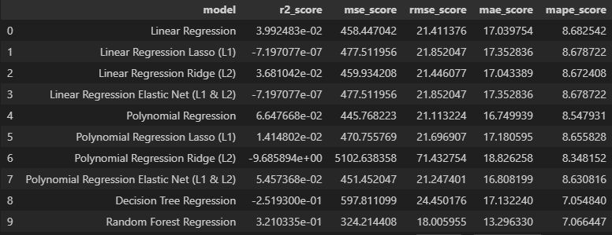
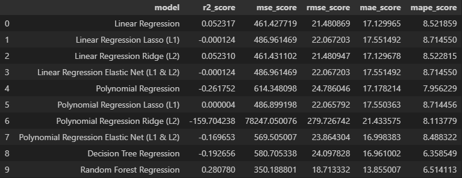
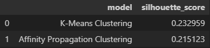

# DATA MONEY COMPANY - MACHINE LEARNING INSIGHTS PROJECT

___

_A demonstração detalhada do código pode ser conferida [neste link.](https://github.com/AndreMenezesDS/machine_learning_test/blob/main/ml_trials.ipynb)_

# 1.0 RESUMO

___

Data Money é uma empresa que oferece consultoria em análise e ciência de dados, com orientação a otimizar resultados de empresas parceiras ao redor do mundo.
A metodologia de trabalho da empresa consiste na realização de ensaios para treino e configuração de modelos de machine learning, obtendo insights acionáveis através da interpretação dos resultados obtidos.

_*Este é um projeto fictício. A empresa, o contexto e as perguntas de negócio não são reais, e prestam apenas como simulação de um projeto real._

# 2.0 PROBLEMA DE NEGÓCIO

___

## 2.1 Descrição do Problema

Em vias de manter o ganho de performance do time de dados da empresa, a Data Money 
exigiu a execução de um número maior de testes dos modelos em treino de machine learning, com o objetivo de melhor esclarecer o funcionamento e cenários adequados da aplicação de cada um.
Para tornar essa tarefa possível, fui contratado como cientista de dados com o objetivo de entregar um **ensaio**, explicitando o funcionamento de cada modelo com o uso comparativo de métricas de performance entre os algoritmos.
Como forma de guiar o desenvolvimento do projeto, foram propostas as perguntas de negócio:

-   Através dos resultados obtidos, quais os insights podem ser considerados acionáveis para entender o comportamento de cada modelo de Machine Learning?
-   Em caso de discrepância nos resultados observados de um mesmo modelo para diferentes bases de dados, é possível inferir alguma característica de funcionamento do modelo de Machine Learning?

    

## 2.2 Proposta de Solução

Para organizar a entrega do resultado, separei os resultados dos ensaios em 3 categorias: Ensaios de Classificação, Regressão e Clusterização.
Para os modelos de **aprendizagem supervisionada (Classificação e Regressão)**, foram feitas validações de resultados a partir de uma base de dados pré selecionada de treino:

*   No próprio dataset de **treino**;
*   Em uma base de dados exclusivamente voltada à **validação**;
*   Em um base de dados exclusivamente voltada à **testes**
    *   Totaliza-se então 6 tabelas com os resultados obtidos em aprendizagem supervisionada (3 para modelos de classificação; 3 para modelos de regressão)

Os modelos de aprendizagem supervisionada treinados, seus hiperparâmetros testados e suas respectivas métricas de avaliação serão:

| Modelos de Classificação                      |Hiperparâmetros|
| ---------------------                         | ------------------------------------------------- |
| KNN                                           | Número de Vizinhos (n_neighbors)  |
| Árvore de Decisão                             | Profundidade de Árvore (max_depth)  |
| Random Forest                                 | Número de estimadores (n_estimators), Profundidade de Árvore(max_depth)  |
| Classificação via Regressão Logística         | Força de Regularização ( C ), algoritmo para otimização da função custo (solver), Máximo de iterações p/ convergência(max_iter)  |

*   _Métricas para Classificação_: Accuracy, Precision, Recall e F1_score.

| Modelos de Regressão             | Hiperparâmetros|
| --------------------- | ------------------------------------------------- |
| Regressão Linear                    | (sem parâmetros iteráveis)  |
| Regressão Linear Regularizada Lasso (L1)                | termo multiplicador da penalidade L1(alpha), Número máximo de iterações(max_iter)  |
| Regressão Linear Regularizada Ridge (L2)                   | termo multiplicador da penalidade L1(alpha), Número máximo de iterações(max_iter)  |
| Regressão Linear Regularizada Elastic Net (L1 & L2)       | termo multiplicador da penalidade L1(alpha), Número máximo de iterações(max_iter), Proporção entre as penalidades L1 e L2(l1_ratio)  |
| Regressão Polinomial           | Grau do Polinômio(degree)  |
| Regressão Polinomial Regularizada Lasso (L1)    | termo multiplicador da penalidade L1(alpha), Número máximo de iterações(max_iter), grau do polinômio(degree)  |
| Regressão Polinomial Regularizada Ridge (L2)          | termo multiplicador da penalidade L1(alpha), Número máximo de iterações(max_iter), grau do polinômio(degree) |
| Regressão Polinomial Regularizada Elastic Net (L1 & L2)       | termo multiplicador da penalidade L1(alpha), Número máximo de iterações(max_iter), grau do polinômio(degree), Proporção entre as penalidades L1 e L2(l1_ratio)  |
| Árvore de Regressão        | Profundidade da árvore(max_depth) |
| Random Forest Regressor  | Número de estimadores(n_estimators), Profundidade da Árvore(max_depth) |

*   _Métricas para Regressão_: R² score, Mean Squared Error(MSE), Rooted Mean Squared Error(RMSE), Mean Absolute Error(MAE), Mean Absolute Percentual Error(MAPE)

Para os modelos de **aprendizagem não-supervisionada (Clusterização)**, será apenas 1 tabela com o resultado final contendo os valores da métrica de avaliação obtida para cada modelo. Os modelos treinados, os hiperparâmetros testados e suas respectivas métricas de avaliação serão:

| Modelos de Clusterização                      |Hiperparâmetros|
| ---------------------                         | ------------------------------------------------- |
| KMeans                                        | Número de Clusters(k)  |
| Affinity Propagation                          | Preference  |

*   _Métrica para Clusterização_: Silhouette Score

# 3.0 ANÁLISE DE PERFORMANCE

___
## 3.1 Análise dos Resultados
_O Detalhamento da setagem dos hiperparâmetros que contextualizam os resultados aqui mostrados podem ser conferidos [neste link.](https://github.com/AndreMenezesDS/machine_learning_test/blob/main/ml_trials.ipynb)_

### 3.1.1 Classificação

*   Training Dataset

    

*   Validation Dataset

    

*   Test Dataset

    

### 3.1.2 Regressão

*   Training Dataset

    

*   Validation Dataset

    

*   Test Dataset

    

### 3.1.3 Clusterização

    

## 3.2 Principais Insights Obtidos
*   Foram identificadas situações de underfitting em:
    *   Algoritmos simples(base) que não conseguem representar o comportamento dos dados: KNN(Classificação), Regressões Lineares, Regressões Polinomiais de baixo grau.
    *   Modelos de Regressões Regularizadas com altos valores de penalidade L1 e L2.
*   Foram identificadas situações de overfitting em:
    *   Algoritmos baseados em árvores com grandes profundidades;
    *   Regressões polinomiais de alto grau
        *   NOTA: Expansões polinomiais de grau elevado são processos custosos computacionalmente.
*   Insights referentes à Generalização da aplicação dos modelos treinados:
    *   Na Classificação via regressão Logística, otimizadores da função de custo com adição da penalidade L1 não foram capazes de convergir a função de custo para a otimização dos scores, uma vez que há uma tendência em não performar bem para datasets pequenos (validação e teste)
    *   Regressores Regularizados, em geral, conferem maior capacidade de generalização aos modelos de machine learning.
    *   O aumento no número de estimadores em algoritmos de Random Forest conferem maior capacidade de generalização quando em comparação ao modelo de uma árvore singular.
*   Clusterização:
    *   A escolha inapropriada de parametros (como nº de clusters em KMeans), geram resultados muito abaixo do esperado, fazendo-se necessário o monitoramento da setagem do modelo.
    *   Ambos os algoritmos não lidam bem com outliers, uma vez que deslocam o cálculo da média dos centroídes de cada cluster(KMeans)/não se saia bem com dados em formatos complexos em clusters não esféricos(Affinity Propagation)

# 4.0 FERRAMENTAS E TÉCNICAS UTILIZADAS

___

-   Backend & Data Science:  
-    Apresentação & Frontend :  ,   
 -  Machine Learning & Análise de Dados:  ,  , ,  
 -   Editores & IDEs :  , 
- Versionamento de Código:  , 

# 5.0 CONTATOS

___

-  ou 
- 
- 
